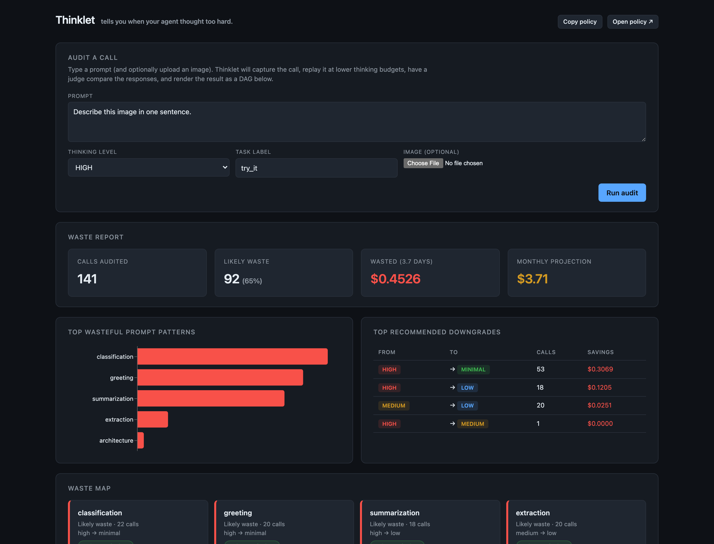
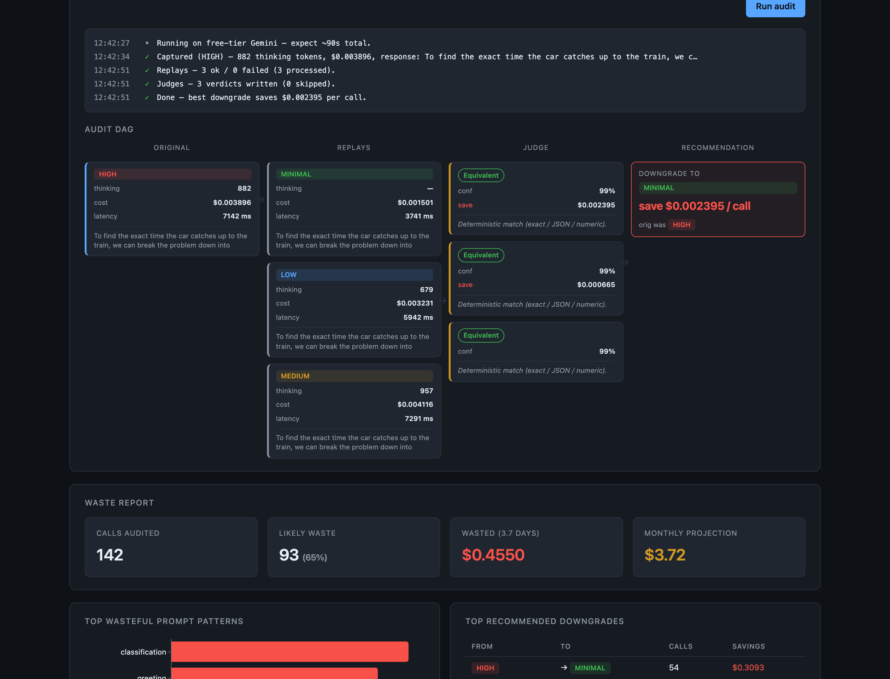
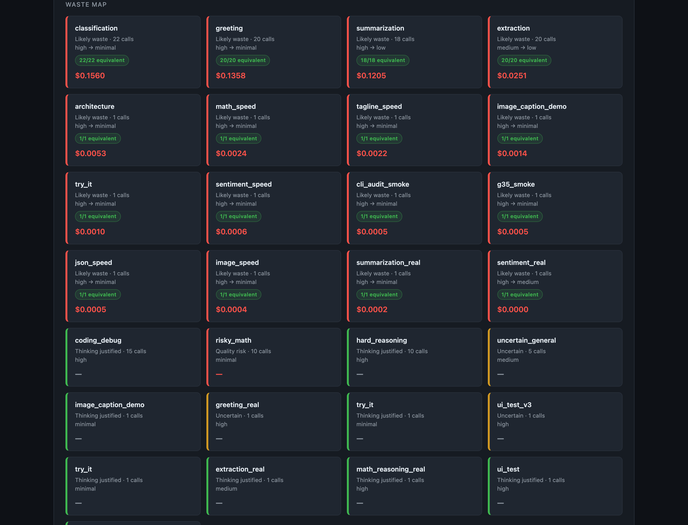
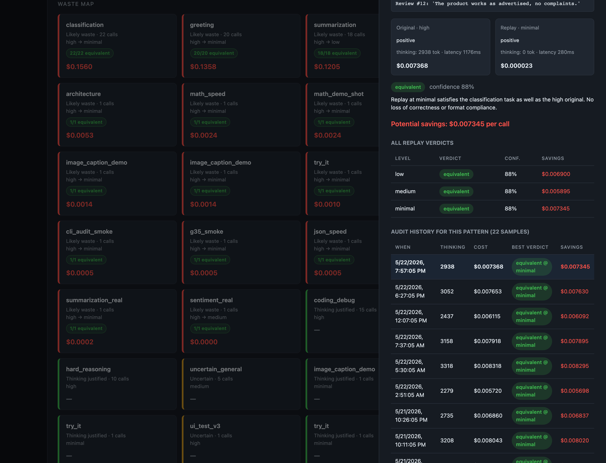

# Thinklet

> **Thinklet tells you when your agent thought too hard.**
>
> A post-hoc thinking-budget audit layer for Gemini agents. Captures each
> LLM call's thinking budget, replays the same prompt at lower budgets,
> compares responses, and reports where money was wasted without losing
> answer quality. Works for **text** *and* **multimodal** calls.

<p align="center">
  
  <br/>
  <em>The dashboard's top fold: interactive audit panel + headline waste numbers (live, from a 141-call audit).</em>
</p>

---

## Hackathon submission

| What | Where |
|---|---|
| 🚀 **One-line pitch** | "Thinklet measures the hidden thinking-token burn on Gemini calls, replays them at lower budgets, has a judge compare outputs, and tells you which prompt patterns can run cheaper without losing quality." |
| 🎬 **Screencast (90 s)** | `docs/screencast.mp4` *(or hosted link)* |
| 📸 **Screenshots** | [`docs/screenshots/`](docs/screenshots/) — headlines, Waste Map, Try Thinklet DAG, drawer history |
| 📘 **Deep dive doc** | [`docs/THINKLET.md`](docs/THINKLET.md) — architecture, 9 use cases, value math, limitations |
| 🧪 **Tests** | `pytest backend/tests/` → **22 passing** |
| 🔧 **One-command demo** | `bash scripts/run_demo.sh` |
| 💻 **CLI** | `scripts/thinklet audit "prompt..."` |
| 📋 **Release notes** | [`RELEASE.md`](RELEASE.md) |

**Built in 24 hours, then iterated.** What's in this repo includes the
original 9-phase MVP scope **plus** two unplanned but shipped follow-ups:
multimodal support and the interactive Try Thinklet UI, plus six
day-of-work polish items (upward fan-out, 429 retry, sample-size
confidence, run history, policy export, CLI).

> Thinklet is **not** LangSmith. Thinklet is **not** a router. Thinklet is a
> thinking-budget audit dashboard.

📘 **Looking for the deep dive?** See [docs/THINKLET.md](docs/THINKLET.md) —
architecture, design decisions, 9 use cases, value quantification, and the
honest limitations.

📸 **Preparing the submission?** See [docs/SUBMISSION.md](docs/SUBMISSION.md)
for the screenshot shot list and 90-second screencast script.

## What Thinklet is / is not

| Thinklet IS | Thinklet IS NOT |
|---|---|
| A post-hoc auditor of thinking-budget cost vs. quality | A trace-collection / observability platform |
| A dashboard that shows you which calls used too much thinking | A live router that picks the cheapest level per call |
| Multimodal-aware (text + image audits, same UX) | A multimodal model itself |
| A simple SDK + FastAPI + DuckDB + React MVP | A multi-tenant SaaS or production observability backend |
| Demo-first; real Gemini behind a flag | A production telemetry exporter (yet — see Future work) |

## 60-second pitch

AI engineers ship features behind Gemini with `thinking_budget=HIGH` because
it's safest. But for a lot of calls — greetings, classifications, simple
extraction, summarization, image captioning — HIGH burns 500–3,000 hidden
reasoning tokens to produce an answer that MINIMAL would have produced.
Thinklet replays every captured call at lower thinking budgets, has a judge
compare outputs, and shows you the cells where downgrading is safe — and the
cells where it would hurt quality.

## Quick start

```bash
# One command (creates venv if missing, seeds DB, starts backend + frontend):
bash scripts/run_demo.sh
# Open http://localhost:5173 — Ctrl-C to stop.
```

Demo mode is the default. To wire real Gemini, paste a key into `.env`
(`GEMINI_API_KEY=…`) and flip `THINKLET_DEMO_MODE=false`. The script
auto-loads `.env`, so the next `bash scripts/run_demo.sh` runs in real mode.

### Manual setup

```bash
# 1. Python (3.11)
python3.11 -m venv .venv
source .venv/bin/activate
pip install -r requirements.txt

# 2. Env
cp .env.example .env
# THINKLET_DEMO_MODE=true is the default — no API key needed.

# 3. Frontend deps
(cd frontend && npm install)

# 4. Seed
python scripts/seed_demo.py

# 5. Backend
bash scripts/run_backend.sh
# -> http://localhost:8000/health

# 6. Frontend
bash scripts/run_frontend.sh
# -> http://localhost:5173
```

## Interactive "Try Thinklet" panel

Right at the top of the dashboard. Three things you can do:

1. **Type a prompt + click Run audit** — Thinklet captures the call at your
   chosen thinking level, replays it at all lower levels, has a judge compare
   them, and renders the result as a DAG.
2. **Upload an image** (PNG / JPEG / WebP, ≤ 4 MB) — the multimodal flow uses
   the same DAG; you'll see the hidden thinking-token burn on image tasks.
3. **Read the step-by-step log** while it runs — you see exactly which API
   calls fired, how much each cost, and which judge verdict landed.

The DAG layout (real screenshot from a live audit):

<p align="center">
  
  <br/>
  <em>A multi-step math prompt audited live: HIGH burned 882 thinking tokens; MINIMAL burned 0 and got the same answer. Recommended downgrade saves $0.002395/call.</em>
</p>

ASCII version for terminal viewers:

```
┌────────────┐     ┌──────────────┐     ┌──────────────┐     ┌──────────────┐
│ Original   │     │ Replay MED   │     │ Judge:       │     │ Recommended  │
│ HIGH       │ ──▶ │ Replay LOW   │ ──▶ │  equivalent  │ ──▶ │ MINIMAL      │
│ 850 tok    │     │ Replay MIN   │     │  equivalent  │     │ save $0.0034 │
│ $0.0035    │     │              │     │  equivalent  │     │ per call     │
└────────────┘     └──────────────┘     └──────────────┘     └──────────────┘
```

After the audit completes, the new pattern auto-appears in the Waste Map
below — refresh isn't needed.

## 90-second seeded demo path

Even without an API key, the seed plants 8 narrative patterns across 120
calls and 335 replays/judges covering the full waste/risk taxonomy:

| # | Pattern | Original | Verdict | Story |
|---|---|---|---|---|
| 1 | `greeting` | HIGH | equivalent at MINIMAL | "HIGH spent ~2,800 thinking tokens on `Hi! Thanks for reaching out`" |
| 2 | `classification` | HIGH | equivalent at MINIMAL | "Sentiment label is one word — HIGH is wasted budget" |
| 3 | `extraction` | MEDIUM | equivalent at LOW | "Pulling an order ID from one sentence" |
| 4 | `summarization` | HIGH | equivalent at LOW | "LOW summarizes 2 sentences just as well" |
| 5 | `coding_debug` | HIGH | degraded at lower | "Root-cause-and-patch genuinely needs the reasoning budget" |
| 6 | `hard_reasoning` | HIGH | materially_different at lower | "Multi-step math; LOW gets a different answer" |
| 7 | `risky_math` | MINIMAL | materially_different (other way) | "Calculus shipped at MINIMAL; HIGH would have been right" |
| 8 | `uncertain_general` | MEDIUM | uncertain | The judge correctly refuses to commit |

**The Waste Map at a glance** (every cell shows the verdict color, sample count, and confidence badge):

<p align="center">
  
  <br/>
  <em>The full verdict taxonomy in one frame. Red = waste (e.g., classification 22/22 equivalent). Green = thinking was justified (coding_debug, hard_reasoning). Yellow = uncertain. Per-cell confidence badges quantify how many samples agreed.</em>
</p>

**Click path:**

1. Open http://localhost:5173 — "Demo Mode" pill is top-right.
2. Headlines: `Wasted (~3 days)` ≈ $0.44, `Monthly projection` ≈ $4.40.
3. Top patterns chart — `classification`, `greeting`, `summarization` are red.
4. Waste Map — separates *can downgrade* from *can't*.
5. Click `risky_math` (red, but for quality, not cost) — drawer shows the
   per-call comparison: MINIMAL gave the wrong answer; HIGH would have caught
   it. This is the "Thinklet flags risk, not just waste" beat.
6. Click a `classification` cell — drawer shows two near-identical responses,
   verdict pill = `equivalent`, savings line **plus the full audit history**:

<p align="center">
  
  <br/>
  <em>Side-by-side original vs replay, verdict pill with confidence, per-call savings, and the full 22-sample audit history so you can tell robust patterns from flappy ones.</em>
</p>

7. **Try it live**: scroll up, type a prompt in the top panel, run the audit,
   watch the DAG materialize.

## Architecture

```mermaid
flowchart LR
  UI[Try Thinklet UI] -- multipart --> CAP[/audit/capture/]
  SDK[Thinklet SDK] -- POST /spans --> API[FastAPI]
  CAP --> DB[(DuckDB)]
  API --> DB
  SCOPED[/audit/{id}/replay /judge/] -- per-span --> DB
  GLOBAL[/replay/run /judge/run/] -- batch --> DB
  API --> DASH[React Dashboard]
  DASH --> TRY[Try Thinklet panel]
  DASH --> WR[Waste Report]
  DASH --> WM[Waste Map]
  DASH --> TF[Trace Feed]
```

- **SDK** (`sdk/thinklet_sdk/`) wraps `google-genai`. Default model is
  `gemini-3.5-flash`. Accepts `prompt=…` for text or `contents=…` for
  multimodal (Gemini-native Parts list with `inline_data` blobs for images).
- **Backend** (`backend/app/`) is FastAPI + DuckDB single-file. Two surface
  areas:
  - **Global** (`/spans`, `/replay/run`, `/judge/run`) — used by capture
    scripts and CI-style batch audits.
  - **Scoped** (`/audit/capture`, `/audit/{span_id}/replay`,
    `/audit/{span_id}/judge`) — used by the Try Thinklet UI for per-call
    auditing.
- **Replay engine** fans out each span to all *lower* thinking budgets.
  Real-API failures (network, quota) fall back to deterministic demo replays
  so the pipeline always completes.
- **Judge** is deterministic-first (exact / JSON / numeric), with a Gemini
  LLM judge as the fallback. Default 3 votes with shuffled A/B order;
  configurable down to 1 via env for tight rate-limit budgets.
- **Dashboard** is React + Vite + Recharts. Hand-drawn HTML/CSS DAG — no
  graph libraries.

### Thinking-budget mapping

Default model is **`gemini-3.5-flash`**. The integer-budget API works
identically on the 2.5 family and the 3.x / 3.5 family (the string
`thinking_level` enum is only honored by the 3.x family — Thinklet uses the
integer budget for forward compatibility):

| Level | `thinking_budget` |
|---|---|
| `minimal` | 0 (off) |
| `low` | 1024 |
| `medium` | 4096 |
| `high` | 24576 (max for Flash) |

Heads-up: **Gemini's adaptive thinking** means HIGH (budget 24576) doesn't
always burn the full budget — for trivial prompts on 3.5 Flash we observed
~100–250 tokens at HIGH, not the full 24,576. That actually makes Thinklet's
value sharper: you can only know what HIGH *actually cost you* by measuring.

## Commands

```bash
bash scripts/run_demo.sh                  # reset + backend + frontend, one shot
python scripts/seed_demo.py               # re-seed without wiping
python scripts/reset_demo.py              # wipe + re-seed
python scripts/sdk_smoke.py               # write 3 SDK-captured text spans
python scripts/multimodal_demo.py         # one image + caption call at HIGH and MINIMAL
python scripts/real_scale_demo.py         # 5 varied prompts across the taxonomy
python scripts/gemini_sanity.py           # verify real API access (optional)
pytest backend/tests/                     # 17 backend tests
curl -X POST localhost:8000/replay/run    # batch-process pending replays
curl -X POST localhost:8000/judge/run     # batch-process pending judges
```

## HTTP endpoints

| Method | Path | Purpose |
|---|---|---|
| GET | `/health` | demo-mode flag + total span count |
| POST | `/spans` | Ingest a captured span (used by SDK) |
| GET | `/spans?limit=N` | Recent spans for TraceFeed |
| GET | `/spans/{id}/detail` | Original + all replays + judges for drill-down |
| GET | `/waste-report` | Aggregate report (headlines, top patterns, recommended downgrades) |
| GET | `/waste-map` | Cells grouped by `task_label × prompt_hash × original_level` |
| POST | `/replay/run` | Batch-process all pending replay_jobs |
| POST | `/judge/run` | Batch-process all (span, replay_result) pairs without verdicts |
| POST | `/audit/capture` | **multipart** — capture one new call (with optional image upload). Returns the persisted Span. |
| POST | `/audit/{span_id}/replay` | Replay only for the given span |
| POST | `/audit/{span_id}/judge` | Judge only for the given span's replays |

## Configuration (env vars)

| Variable | Default | Purpose |
|---|---|---|
| `GEMINI_API_KEY` | (empty) | Real-API key. Empty → forces demo mode. |
| `THINKLET_DEMO_MODE` | `true` | When `false` and the key is set, real Gemini fires. |
| `THINKLET_BACKEND_URL` | `http://localhost:8000` | Where the SDK posts spans. |
| `THINKLET_DB_PATH` | `data/thinklet.duckdb` | DuckDB file location. |
| `THINKLET_REPLAY_SLEEP_S` | `13.0` | Seconds between real-Gemini replay calls. Set `0` on paid tier. |
| `THINKLET_JUDGE_VOTE_SLEEP_S` | `4.0` | Seconds between LLM judge votes. Set `13.0` for free-tier 5 RPM. |
| `THINKLET_JUDGE_VOTES` | `3` | Majority vote count. Drop to `1` to stretch quota; lose tie-break. |

**Free-tier sane defaults** (Gemini Flash free tier is 5 RPM, 20 RPD):

```bash
export THINKLET_REPLAY_SLEEP_S=13
export THINKLET_JUDGE_VOTE_SLEEP_S=13
export THINKLET_JUDGE_VOTES=1
```

**Paid tier / Gemini 3.5 Flash with higher quota**:

```bash
export THINKLET_REPLAY_SLEEP_S=0
export THINKLET_JUDGE_VOTE_SLEEP_S=0
export THINKLET_JUDGE_VOTES=3
```

In paid-tier mode an end-to-end Try Thinklet audit (capture + 3 replays + 3
judges with deterministic-match short-circuit) completes in **~3–5 seconds**.

## Data model

DuckDB at `data/thinklet.duckdb` with four tables:

- **`spans`** — one row per captured Gemini call. Includes `thinking_tokens`
  (the hidden burn) and `contents_json` (multimodal Parts list, base64-encoded
  for inline_data parts; NULL for text-only).
- **`replay_jobs`** — one row per (span, target_level) replay attempt, with
  `status` (pending/running/completed/failed) and `attempts`.
- **`replay_results`** — successful replay outputs with their own
  `thinking_tokens` + `estimated_cost_usd`.
- **`judge_results`** — verdict per (span, replay) pair with `confidence`,
  `votes_json`, `recommended_level`, and `estimated_savings_usd`.

Schema lives in [`backend/app/db.py`](backend/app/db.py). New columns are
added via an idempotent `_migrate()` call on every connect (currently
`contents_json` in spans).

## Cost logic

`backend/app/pricing.py` keeps the pricing table. Key assumption: Gemini's
`thoughts_token_count` is **separate** from `candidates_token_count` in
`usage_metadata`. We charge them both at the output rate; the SDK extracts
them separately so we never double-count. Rates are placeholders — bump the
constants and re-run for your real prices.

## SDK usage

```python
from thinklet_sdk import ThinkletClient

tk = ThinkletClient()  # auto-loads .env, picks demo mode if no key

# Text-only
r = tk.call(
    prompt="Classify sentiment: 'Works as described.'",
    thinking_level="high",
    task_label="sentiment_v1",
)
print(r.thinking_tokens, r.text)

# Multimodal
with open("photo.jpg", "rb") as f:
    image_bytes = f.read()

r = tk.call(
    contents=[
        {"text": "Describe this product photo in one sentence."},
        {"inline_data": {"mime_type": "image/jpeg", "data": image_bytes}},
    ],
    thinking_level="high",
    task_label="product_caption",
)
```

## Known limitations (honest)

- The LLM judge can be wrong. We mitigate with deterministic-first checks
  + (default) 3-vote majority + `uncertain` bucket.
- Replay outputs are nondeterministic on the real Gemini path; demo mode is
  deterministic for reproducible storytelling.
- Not suitable for sensitive prompts unless your SDK redacts before
  `POST /spans`. The schema accepts `prompt_redacted` and `response_redacted`
  exactly so you can pre-redact.
- Best signal for repeated prompt patterns (same `prompt_hash` across calls).
  One-off calls still get audited but won't roll up into a "pattern" cell.
- Multimodal: image bytes are persisted **inline** in `spans.contents_json`
  (base64). Fine for demo / dev; for production with many large images,
  move blobs to object storage and store URIs in `file_data` instead.
- Free-tier Gemini Flash is **5 RPM / 20 RPD**, so a single Try Thinklet
  audit can take ~90 s and a few audits/day exhausts the daily quota. On
  paid tier / Gemini 3.5 Flash this drops to ~3–5 seconds per audit. Replay
  engine falls back to deterministic demo replays on quota exhaustion so
  the UI keeps working either way.

## Future work

- LangSmith / OpenTelemetry exporter so Thinklet can audit traces from
  existing telemetry, not just SDK-captured spans.
- Multi-turn chat support in the Try Thinklet panel.
- Policy suggestions ("downgrade `classification` HIGH→MINIMAL across all
  callers").
- CI cost regression checks (flag PRs that raise per-prompt thinking budget).
- Routing recommendations once enough audit data exists.
- External blob storage for multimodal inputs (S3 / GCS) instead of inline
  base64 in DuckDB.

## Tests

```bash
.venv/bin/python -m pytest backend/tests/ -q
# 17 passed
```

| File | Coverage |
|---|---|
| `test_api.py` | health, ingest, span detail, waste-report shape, waste-map shape |
| `test_replay.py` | fan-out math, minimal-skip, idempotency, **span_id scoping** |
| `test_judge.py` | deterministic checks (exact / JSON / numeric), savings calc, idempotency, **span_id scoping**, low-overlap demo path |

## Screenshot fallback

If the dashboard won't run during the demo (or you want a hand-off artifact),
capture three views while `http://localhost:5173` is open:

1. Top of the page — Try Thinklet panel + headlines (the money slide).
2. Try Thinklet DAG after one live audit (the proof-it-works slide).
3. Waste Map drawer open on a wasteful cell (the per-call comparison slide).

Save them to `docs/screenshots/`.

## Status

- [x] Repo skeleton + Gemini sanity script
- [x] Demo seed data (120 spans / 335 replays / 335 judges)
- [x] Backend ingest + query API
- [x] SDK capture layer (text)
- [x] **SDK multimodal support** (text + inline_data + file_data Parts)
- [x] Replay engine (paced, with real-API failure fallback)
- [x] Judge + deterministic checks (paced, configurable vote count)
- [x] Dashboard (Waste Report, Waste Map, Trace Feed, drill-down drawer)
- [x] **Try Thinklet interactive panel** (form + progress log + DAG)
- [x] **Real Gemini wiring** (`thinking_budget` integer mapping, env auto-load)
- [x] End-to-end demo scripts (text + multimodal + 5-prompt scale)
- [x] Hardening + this README
