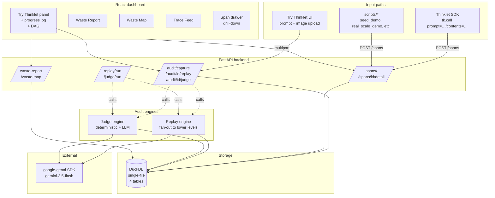

# Thinklet — Architecture, Design & Use Cases

> **One-line product:** Thinklet is a post-hoc auditor that tells you which of your Gemini calls thought too hard, which didn't think hard enough, and how much money the difference is worth.

---

## Table of contents

1. [Executive summary](#1-executive-summary)
2. [The problem Thinklet solves](#2-the-problem-thinklet-solves)
3. [Core concept](#3-core-concept)
4. [Architecture](#4-architecture)
5. [Data model](#5-data-model)
6. [Pipeline deep dive](#6-pipeline-deep-dive)
7. [Cost & savings logic](#7-cost--savings-logic)
8. [Design decisions & tradeoffs](#8-design-decisions--tradeoffs)
9. [Use cases](#9-use-cases)
10. [Value quantification](#10-value-quantification)
11. [Limitations & honest caveats](#11-limitations--honest-caveats)
12. [Extension points / future work](#12-extension-points--future-work)
13. [Appendix — quick reference](#13-appendix--quick-reference)

---

## 1. Executive summary

AI engineers ship features behind Gemini with `thinking_budget=HIGH` because it's safest. But for many call types — greetings, classifications, simple extractions, summarizations, image captions — HIGH burns hundreds-to-thousands of *hidden* reasoning tokens (`thoughts_token_count`) that don't appear in the response or in normal traces, but show up on the bill.

**Thinklet replays every captured call at lower thinking budgets, uses a judge to compare outputs, and reports where downgrading is safe — and where it would hurt quality.**

Three things make it work:
1. **Hidden cost is observable.** Gemini reports `thoughts_token_count` separately from `candidates_token_count` in `usage_metadata`. Thinklet captures both.
2. **Replay is deterministic enough to audit.** Same prompt + same model + lower budget → a comparable response. The judge (deterministic-first, LLM-fallback) decides equivalence.
3. **Patterns repeat.** One audit produces a *policy* applied across many production calls. Recurring savings, one-time cost.

**Built as a 24-hour hackathon MVP.** Python 3.11 + FastAPI + DuckDB + React + Vite + Recharts. No Redis, no Kafka, no SSE, no auth. ~~2,500 lines of code total.

---

## 2. The problem Thinklet solves

### The hidden cost of thinking budgets

Gemini 2.5+ models support a `thinking_budget` knob (0 to 24,576 on Flash; higher on Pro). The bigger the budget, the more hidden reasoning tokens the model is allowed to spend before producing a visible answer. Those reasoning tokens are real billed output tokens — you just never see them.

**The default behavior of every shipping team:** set `thinking_budget=HIGH`. It's the safest setting. It produces the best answers. It also produces the highest bill.

### Why this isn't already solved

| Approach | What it does | Why it's insufficient |
|---|---|---|
| Read the docs | Pick a thinking level per prompt manually | Doesn't scale beyond a handful of prompts; can't predict which prompts need it |
| Trust adaptive thinking | Gemini spends what it deems necessary up to your cap | Adapts UP to budget, doesn't tell you the FLOOR; calibrates spend to the cap you set |
| Build a router | Auto-pick a level per call at runtime | High blast radius if wrong; opaque; hard to audit; routes individual calls instead of patterns |
| Standard observability (LangSmith, Datadog) | Trace and cost-track LLM calls | Tells you what *was* spent, not what *should* have been spent |
| Ad-hoc A/B testing | Manually compare two settings on sample prompts | Doesn't scale; no equivalence judging; no recurring measurement |

**Thinklet's niche:** a post-hoc auditor that produces *policies* (downgrade patterns to specific levels), not per-call decisions. It runs once per prompt pattern, produces evidence, then humans deploy.

### What "post-hoc" means here

Thinklet does not sit in the request path. It does not change which model is called. It does not affect latency of production calls. It runs *after* you've captured calls (sample or production), explores the alternative-budget space, and tells you what would have happened. You then apply the recommendation manually in your code.

---

## 3. Core concept

### One model, one key, one parameter that varies

A common misconception: "Are you using multiple models or keys to test different levels?" No. Thinklet uses **one model** and **one API key**. The only thing that varies per call is the `thinking_budget` integer passed to `GenerateContentConfig`:

```python
client.models.generate_content(
    model="gemini-3.5-flash",                  # unchanged
    contents=prompt,                           # unchanged
    config=types.GenerateContentConfig(
        thinking_config=types.ThinkingConfig(
            thinking_budget=24576,             # ← THIS varies
        )
    ),
)
```

Thinklet's friendly labels map to integers:

| Thinklet level | `thinking_budget` | Behavior |
|---|---|---|
| `minimal` | 0 | Thinking OFF (hard switch, not a cap) |
| `low` | 1024 | Cap at ≤1024 hidden tokens |
| `medium` | 4096 | Cap at ≤4096 hidden tokens |
| `high` | 24576 | Cap at ≤24576 (Flash max) |

### The audit loop

```
1. Capture     — Record one Gemini call as a "span" with thinking_tokens captured.
2. Replay      — Re-issue the same prompt at every lower thinking_budget.
3. Judge       — For each (original, replay) pair, decide:
                   equivalent | degraded | materially_different | uncertain
4. Recommend   — Per span, pick the lowest-level "equivalent" replay.
                 That's the recommended downgrade.
5. Roll up     — Aggregate spans by (task_label, prompt_hash, original_level)
                 into Waste Map cells: red (waste), green (justified),
                 yellow (uncertain), red (quality risk).
```

### The three things Thinklet outputs

1. **A per-call drill-down** showing original vs replays side-by-side, judge verdict, savings.
2. **A Waste Map** grouped by prompt pattern, with red/green/yellow color coding.
3. **A Waste Report** with headlines: total wasted, monthly projection, top patterns, top recommended downgrades.

---

## 4. Architecture

### System overview



### Component breakdown

| Component | Path | Role |
|---|---|---|
| **SDK** | `sdk/thinklet_sdk/` | Explicit wrapper around `google-genai`. Two surface forms: `tk.call(prompt=…)` (text) and `tk.call(contents=[…])` (multimodal). Computes `prompt_hash`, redacts content, extracts `thoughts_token_count` from `usage_metadata`, POSTs span to backend. |
| **Backend API** | `backend/app/main.py` | FastAPI app. Two endpoint families: **global** (`/spans`, `/replay/run`, `/judge/run`, `/waste-report`, `/waste-map`) for batch flows; **scoped** (`/audit/capture`, `/audit/{id}/replay`, `/audit/{id}/judge`) for the interactive Try Thinklet UI. |
| **Database** | `backend/app/db.py` | DuckDB single-file store at `data/thinklet.duckdb`. Idempotent schema bootstrap; runtime ALTER for migrations (currently the `contents_json` column for multimodal). |
| **Replay engine** | `backend/app/replay.py` | For each span, creates `replay_jobs` for every lower thinking level. Processes them synchronously with rate-limit pacing. Falls back to deterministic demo replays on real-API failure. |
| **Judge engine** | `backend/app/judge.py` | Deterministic checks first (exact / JSON / numeric). Falls back to Gemini LLM judge with structured output. 3 votes, shuffled A/B order, majority decides; ties → `uncertain`. |
| **Pricing** | `backend/app/pricing.py` | Per-model rates. Bills input + output + thinking tokens (thinking at output rate, separately to avoid double-count). |
| **Frontend** | `frontend/src/` | React + Vite + Recharts dashboard. **Try Thinklet panel** (form + progress log + DAG). **Waste Report** (headlines + top-patterns chart + recommended downgrades). **Waste Map** (color-coded cell grid). **Trace Feed** (recent calls table). **Span drawer** (drill-down). |

### Process model

Single backend process, single frontend dev-server process. DuckDB is in-process; no DB server. No background workers, no message queues, no async job runner. All audit work is synchronous within a request handler.

Per-request DuckDB cursors (not connections) for thread safety under FastAPI's threadpool. The shared connection lives in `app.state.con`; each route calls `app.state.con.cursor()`.

### Synchronous-by-design tradeoff

A real production audit on a paid Gemini tier with rate-limit pacing turned off completes in **~3–5 seconds** per Try Thinklet audit (1 original + 3 replays + 3 judge votes, with deterministic-match short-circuit on simple cases). Free-tier with paced calls is ~80–100 seconds.

If pacing weren't synchronous, we'd need a job queue, worker process, status-polling endpoint, and the UI would need SSE or polling — all explicitly excluded from the MVP scope. The current design keeps everything in one HTTP request lifecycle per phase (capture / replay / judge / detail).

---

## 5. Data model

DuckDB with four tables (schema in `backend/app/db.py`):

### `spans` — one per captured call

| Column | Type | Notes |
|---|---|---|
| `id` | VARCHAR PK | UUID |
| `created_at` | TIMESTAMP | Insertion time |
| `trace_id` | VARCHAR | Optional, for joining with external traces |
| `call_id` | VARCHAR | Optional, for joining with caller systems |
| `prompt_hash` | VARCHAR | sha256(model \| prompt) — groups identical prompts across calls |
| `prompt_redacted` | VARCHAR | Stored prompt (or structural summary for multimodal) |
| `response_redacted` | VARCHAR | Stored response text |
| `model` | VARCHAR | e.g. `gemini-3.5-flash` |
| `thinking_level_used` | VARCHAR | `minimal` \| `low` \| `medium` \| `high` |
| `input_tokens` | INT | from `usage_metadata.prompt_token_count` |
| `output_tokens` | INT | from `usage_metadata.candidates_token_count` |
| `thinking_tokens` | INT (nullable) | from `usage_metadata.thoughts_token_count` |
| `total_tokens` | INT | Sum |
| `latency_ms` | INT | Wall-clock for the Gemini call |
| `estimated_cost_usd` | DOUBLE | Computed via pricing.py |
| `task_label` | VARCHAR | User-supplied grouping label (e.g. `sentiment_v1`) |
| `source` | VARCHAR | `real` (hit Gemini) or `demo` (synthetic) |
| `contents_json` | VARCHAR (nullable) | Multimodal Parts list, base64-encoded inline_data. NULL for text-only. |

### `replay_jobs` — work queue

One row per (span, target_level) pair. Lifecycle: `pending → running → completed | failed`. Includes `attempts` counter and `error` text. Idempotent: a completed result for the same (span, level) tuple prevents duplicate work.

### `replay_results` — successful replay outputs

Mirrors the span shape but tied back to a span by `span_id` + `target_thinking_level`. Each replay is a fresh Gemini call at the lower budget, with its own `thoughts_token_count` and cost.

### `judge_results` — verdict per (span, replay) pair

| Column | Notes |
|---|---|
| `original_level`, `alternative_level` | The two budgets being compared |
| `verdict` | `equivalent` \| `degraded` \| `materially_different` \| `uncertain` |
| `confidence` | 0.0–1.0 |
| `reasoning` | Short text — either "Deterministic match" or one-line from LLM judge |
| `votes_json` | JSON array of the 3 vote verdicts |
| `recommended_level` | Lowest equivalent level for this span (NULL if none) |
| `estimated_savings_usd` | `max(0, original_cost − replay_cost)` if verdict equivalent AND replay is at a lower level. Else 0. |

### Key invariants

- **Prompt-hash grouping**: Same prompt at different levels share `prompt_hash`. Different prompts at the same level get different hashes.
- **Best-per-span**: When rolling up savings into reports, Thinklet picks the **lowest-level equivalent replay per span** to avoid triple-counting (a HIGH span with equivalent replays at LOW + MEDIUM + MINIMAL counts only the MINIMAL savings).
- **Idempotency**: `(span_id, target_thinking_level)` is effectively unique in `replay_results`; `(span_id, replay_result_id)` is effectively unique in `judge_results`. Re-running any audit does zero new work.

---

## 6. Pipeline deep dive

### 6.1 Capture

Two paths:

**A. SDK** (`tk.call(...)`)
```python
from thinklet_sdk import ThinkletClient
tk = ThinkletClient()  # auto-loads .env

r = tk.call(
    prompt="Classify sentiment: '…'",
    thinking_level="high",
    task_label="sentiment_v1",
)
# r.thinking_tokens = 211    (the hidden burn)
# r.text = "Positive"
# r.span_id = "abc123…"      (returned from POST /spans)
```

**B. POST /spans** directly (for non-Python callers)

A FastAPI multipart/form-data POST also exists at `/audit/capture` — used by the interactive UI, accepts an optional image upload.

For each capture:
1. Compute `prompt_hash = sha256(model | prompt)[:32]`. Multimodal: hash walks the normalized Parts list, including image bytes.
2. Build `prompt_redacted` — either truncated prompt (text) or structural summary (multimodal: `"text(38 chars) + inline_data(image/png, 67 bytes)"`).
3. Build `contents_json` — only for multimodal; serialized JSON of the Parts list with base64-encoded inline_data.
4. Call Gemini with the chosen `thinking_budget`.
5. Extract `usage_metadata.{prompt_token_count, candidates_token_count, thoughts_token_count}`.
6. Compute cost via `pricing.estimate_cost(model, input, output, thinking_tokens)`.
7. INSERT into `spans`.

### 6.2 Replay

Triggered globally by `POST /replay/run` (processes all pending jobs across the system) or per-span by `POST /audit/{span_id}/replay`.

For each unique span:
1. Determine target levels = all levels strictly *lower* than the span's `thinking_level_used`. (HIGH → {MEDIUM, LOW, MINIMAL}; MEDIUM → {LOW, MINIMAL}; LOW → {MINIMAL}; MINIMAL → {} ).
2. For each target, ensure a `replay_jobs` row exists (idempotent: skip if present).
3. Process pending+failed jobs in sequence:
   - Mark `running`, increment `attempts`.
   - If `replay_results` already exists for (span, target) → mark `completed`, skip.
   - Otherwise call Gemini with the target's `thinking_budget`. Use `contents_json` if multimodal; else plain prompt.
   - On success: INSERT `replay_results`, mark job `completed`.
   - On failure: mark `failed` with error message. (Demo fallback: if real-API call throws, replay a deterministic demo response so the audit pipeline still completes.)
4. Pacing: `THINKLET_REPLAY_SLEEP_S` env (default 13s) inserts a delay between real-API calls to stay under free-tier RPM. Set to 0 on paid tier.

### 6.3 Judge

Triggered globally by `POST /judge/run` or per-span by `POST /audit/{span_id}/judge`.

For each (span, replay_result) pair without an existing judge_result:

**Step 1 — Deterministic checks (no LLM call):**
- Exact-string match (normalized whitespace + case)
- JSON-equal (parse both, deep-compare)
- Numeric equality within 0.1% (regex-extracted first number from each)

If any fires → verdict `equivalent` with confidence 0.99. **Save the LLM call entirely.** This is the biggest cost optimization in Thinklet: trivial responses (single-word classifications, JSON outputs, numeric answers) never hit the LLM judge.

**Step 2 — LLM judge (only when deterministic fails):**
- 3 votes by default (`THINKLET_JUDGE_VOTES`)
- Each vote shuffles A/B order to control for position bias
- Each vote uses Gemini structured output (JSON mode) with this rubric:

```
Compare task usefulness, factual correctness, completeness,
instruction-following, and format compliance. Do NOT reward verbosity.
Two outputs are equivalent if they satisfy the user's request equally well
even when wording differs.

Return STRICT JSON: {
  "verdict": "equivalent" | "degraded" | "materially_different" | "uncertain",
  "confidence": 0.0..1.0,
  "reasoning": "one short sentence",
  "recommended_level": "minimal" | "low" | "medium" | "high"
}
```

**Step 3 — Aggregate:**
- Majority verdict wins
- If no majority OR average confidence < 0.55 → `uncertain`
- Recommended level = most common across same-verdict votes

**Step 4 — Compute savings:**
```
savings = max(0, original_cost − replay_cost)
         if verdict == "equivalent" AND replay_level < original_level
         else 0
```

### 6.4 Recommend & roll up

In the report queries (`/waste-report`, `/waste-map`):

```sql
-- Best per span CTE: lowest equivalent replay with positive savings
WITH eq AS (
  SELECT j.span_id, j.alternative_level, j.estimated_savings_usd, …
  FROM judge_results j JOIN spans s ON s.id = j.span_id
  WHERE j.verdict = 'equivalent' AND j.estimated_savings_usd > 0
),
ranked AS (SELECT eq.*, level_rank(alt_level) AS lvl_rank FROM eq),
best AS (SELECT span_id, MIN(lvl_rank) AS best_rank FROM ranked GROUP BY 1)
SELECT r.* FROM ranked r JOIN best b
WHERE b.span_id = r.span_id AND b.best_rank = r.lvl_rank
```

This is the most important query in the system. It guarantees: **savings count once per span**, not once per (span, equivalent-replay-level) pair.

---

## 7. Cost & savings logic

### Pricing assumption

Gemini's `usage_metadata.thoughts_token_count` is **separate** from `candidates_token_count`. Pricing treats both at the output rate (Google's actual policy), with thinking tokens added separately. No double-counting.

```
estimated_cost_usd =
    input_tokens          * input_price_per_token
  + output_tokens         * output_price_per_token
  + (thinking_tokens or 0) * output_price_per_token
```

### Per-model rates

```python
# backend/app/pricing.py
PRICING_TABLE = {
    "gemini-2.5-flash":      ($0.30/M input, $2.50/M output),
    "gemini-2.5-pro":        ($1.25/M input, $10.00/M output),
    "gemini-3.5-flash":      ($0.30/M input, $2.50/M output),  # placeholder
    "gemini-3-pro-preview":  ($1.25/M input, $10.00/M output),
}
```

Update with published numbers as Google publishes them.

### Savings calculation

```
For span S originally at level L_orig:
  For each replay at level L_alt < L_orig with verdict == "equivalent":
      candidate_savings = S.cost - replay.cost
  best_savings(S) = MAX(candidate_savings) where verdict equivalent
                    at the LOWEST L_alt (deepest downgrade)
```

This is the per-call savings displayed in the drawer. Multiply by call volume for monthly projection (the headline number).

### Monthly projection math

```
observed_days = (max(created_at) - min(created_at)) in days, floored to 1.0
total_wasted_in_window = sum(best_savings) across all spans
monthly_projection = total_wasted_in_window * 30 / observed_days
```

This is **a linear extrapolation from observed window to a 30-day month**. Not a sophisticated forecast — just enough to make the headline number stakeholder-grade.

---

## 8. Design decisions & tradeoffs

| Decision | Why | Tradeoff |
|---|---|---|
| **DuckDB single-file** | Zero ops, file-based, fast analytics queries | Not multi-tenant; single writer |
| **No background workers** | Synchronous + per-request DuckDB cursor is enough for MVP | Long audits block HTTP; mitigated by per-span scoped endpoints and pacing |
| **Deterministic-first judge** | Skip LLM cost on trivial responses | False negatives if responses differ in trivial whitespace/format |
| **3-vote majority + uncertain fallback** | Controls for LLM judge non-determinism | 3× cost vs single vote; configurable to 1 via env |
| **Per-span scoped audit endpoints** | UI can show step-by-step progress without SSE | Two surfaces (global + scoped); slight code duplication |
| **HTML/CSS DAG (no ReactFlow)** | No new deps; full design control | Manual positioning; less interactive |
| **Integer `thinking_budget` (not string `thinking_level`)** | Works on both 2.5 and 3.x model families; one less API parameter to maintain | None |
| **Demo-mode fallback at every layer** | Pipeline always completes even on quota exhaustion / network error | Slight code complexity; clearly labeled as `source=demo` |
| **`prompt_hash` is content-addressable** | Same prompt across calls groups correctly; image bytes change the hash | Tiny prompt variations create new groups (often a feature, sometimes a bug) |
| **Best-per-span SQL CTE** | Prevents triple-counting savings | More complex query; documented inline |
| **No auth** | Hackathon MVP; single-user demo | Not deployable to multi-tenant prod as-is |
| **No SSE for progress** | Constraint of original MVP spec | UI uses 3 sequential HTTP calls, each showing a progress line |

### Why no router?

A router decides per-call. Thinklet decides per-pattern. The blast radius of a wrong routing decision is one bad user response; the blast radius of a wrong policy recommendation is "you applied it and got a bad response, then you reverted it." The latter is auditable. The former is opaque.

If you want a router, you build one on top of Thinklet's recommendations as a separate component. Don't blend them.

---

## 9. Use cases

### 9.1 Pre-launch cost audit

**Scenario:** You're about to ship an agent to 10× your current users. Finance asks: "What's the unit cost at production volume?"

**Workflow:**
1. Run a representative sample (100–500 calls) of your agent's prompts through Thinklet's SDK with `task_label`s for each prompt family.
2. Trigger `POST /replay/run` + `POST /judge/run`.
3. Open the Waste Report. The headline shows total wasted in the sample window; monthly projection extrapolates to 30 days.
4. Top recommended downgrades table shows the specific config changes: `HIGH→MINIMAL across 42 calls of "sentiment_v1"`.
5. Apply those changes in your agent's config before launch. Re-audit a smaller sample post-deployment to confirm the savings landed.

**Value:** Avoid shipping a feature that becomes a budget surprise after 10× scaling. Specific, evidence-backed line-items to share with finance.

---

### 9.2 Cost-spike investigation

**Scenario:** Your Gemini bill went up 4× this month. Engineering thinks a new agent added complexity; finance suspects volume. You suspect a config change.

**Workflow:**
1. Identify which task labels have grown in volume vs which have grown in per-call cost (using `/spans` or aggregations on the DB).
2. For the per-call-cost growers: run Thinklet audit on a sample.
3. The Waste Map reveals whether the new HIGH-level usage is justified or wasteful.
4. If wasteful: revert to the prior level on those patterns. If justified: that's the answer for finance.

**Value:** Diagnose cost spikes with evidence, not blame. Often reveals an SDK upgrade flipped default thinking levels.

---

### 9.3 Model migration audit

**Scenario:** You upgraded your agent from `gemini-2.5-flash` to `gemini-3.5-flash`. Did the new model change which patterns can run at MINIMAL?

**Workflow:**
1. Re-run the same sample of prompts through Thinklet, once at each model version (use `task_label`s like `sentiment_v1_g25`, `sentiment_v1_g35`).
2. Compare the Waste Map cells side-by-side. Patterns whose color changed from green → red have new downgrade opportunities; red → green means the new model needs more reasoning.
3. Apply the updated policy.

**Value:** Automate the "should we change our config?" decision after model upgrades. Catches free wins that would otherwise sit on the table.

---

### 9.4 Policy generation for prompt patterns

**Scenario:** You want hand-written routing rules like "summarization → LOW, code debug → HIGH" but don't want to guess.

**Workflow:**
1. Capture 5–10 calls per prompt pattern (use `task_label` consistently).
2. Run the audit.
3. For each cell in the Waste Map, take the `recommended_level`. That's your policy entry.
4. Encode the policy as a dict in your agent code:
   ```python
   THINKING_POLICY = {
       "sentiment_v1": "minimal",
       "code_debug_v2": "high",
       "summarization_v1": "low",
       …
   }
   ```

**Value:** Defensible, evidence-backed policies instead of intuition-based config. Each policy entry has a Thinklet judge_result you can point to in PR reviews.

---

### 9.5 Quality risk detection

**Scenario:** Someone shipped a low-thinking-budget config (e.g., MINIMAL) for a task that actually needs reasoning. Quality is degrading silently.

**Workflow:**
1. Capture calls at the current low level (MINIMAL).
2. Thinklet's replay engine replays *upward* for MINIMAL spans (since there's no lower level — see `seed.py`'s `risky_math` pattern logic).
3. The judge marks the higher-level replays as `materially_different` (better) than the original.
4. The Waste Map shows the cell as **RED with verdict `materially_different`** — a *quality risk* flag, not a waste flag.

**Value:** Thinklet detects the OPPOSITE of waste — under-budgeted prompts that are silently producing worse answers. Same dashboard, opposite color of the same red.

> *Note:* The replay engine currently only fans **downward** (lower levels) for non-MINIMAL spans. Upward fan-out for MINIMAL spans is in the seed data demo but not in the live replay engine path — see Future Work.

---

### 9.6 CI cost regression check

**Scenario:** Your team wants to fail a PR if it raises the thinking budget on a pattern Thinklet says doesn't need it.

**Workflow:**
1. In CI, capture a small set of prompts at the PR branch's config.
2. Compare Thinklet's reported `monthly_projection_usd` to a baseline file.
3. Fail the CI job if it crosses a threshold.

**Value:** Continuous protection against thinking-budget creep. Treats Gemini cost like build size or test latency: budget-checked at PR time.

> *Note:* This requires a small CI integration not currently shipped — see Future Work.

---

### 9.7 Multimodal cost auditing

**Scenario:** You added image inputs to your agent. Image understanding is more expensive; thinking budgets matter more.

**Workflow:**
1. Capture image calls via `tk.call(contents=[{"text":…}, {"inline_data":{…}}], …)` or via the Try Thinklet UI.
2. Thinklet hashes the image bytes into `prompt_hash` (so two different images on the same template are different patterns).
3. The audit runs normally; replays re-issue the same image at lower budgets.
4. Find the patterns where MINIMAL is sufficient for image captions / OCR / classification.

**Value:** Image-language workloads are where thinking budgets matter most (highest per-call cost). Thinklet works identically on multimodal calls.

---

### 9.8 Capacity planning

**Scenario:** You're modeling capacity for a new region launch. Need to forecast Gemini spend at projected volume.

**Workflow:**
1. Use Thinklet's audit on current traffic to compute *adjusted* per-call cost per prompt pattern (assuming you'll apply the recommended downgrades).
2. Multiply by projected call volume.
3. Get a realistic capacity number, not a worst-case-everything-at-HIGH number.

**Value:** More accurate capacity forecasts that bake in the optimizations you'll deploy.

---

### 9.9 Vendor/model selection

**Scenario:** You're choosing between Gemini Flash, Gemini Pro, and a competitor model. Cost-per-task matters.

**Workflow:**
1. Capture the same prompt set through Thinklet at each candidate model (currently Gemini-only).
2. For each pattern, take the post-downgrade cost (i.e., the cost at the recommended level, not the default).
3. Compare like-for-like across models.

**Value:** Apples-to-apples comparison that accounts for the cost-optimization headroom of each model. A model that benchmarks "cheap at default" but doesn't allow downgrading may be more expensive than a "pricier" model with strong adaptive thinking.

---

## 10. Value quantification

### Unit economics

For a single audited prompt pattern on `gemini-3.5-flash`:

| Phase | Cost |
|---|---|
| 1 original Gemini call (HIGH) | ~$0.0005 – $0.005 (depends on response length & thinking burn) |
| 3 replay calls (MEDIUM, LOW, MINIMAL) | sum of replay costs, roughly similar to original |
| Up to 9 judge LLM votes | $0 if deterministic check fires; up to ~$0.02 if all LLM-judged |
| **Total audit cost per pattern** | **~$0.01 – $0.05** (one-time) |

### Recurring savings per pattern

```
per_call_savings   = original_cost − recommended_level_cost
monthly_savings    = per_call_savings × calls/day × 30
```

Example from speed_run:
- `math_speed` HIGH → MINIMAL: $0.002442 saved per call
- At 1,000 calls/day: **$73/month saved on that one pattern**
- At 10,000 calls/day: **$733/month saved**

### Break-even analysis

```
break_even_calls = audit_cost / per_call_savings
```

For `math_speed`: $0.009117 audit cost / $0.002442 savings = **3.7 calls to break even.**

For any pattern that runs > 5 times in production, Thinklet's audit pays back. Anything above that is pure return.

### Cumulative value at typical scale

Consider a moderately complex agent: **20 distinct prompt patterns**, **500 calls/day per pattern**, **10 of those patterns turn out downgradeable** by Thinklet's audit.

```
Monthly audit cost (one-time):      20 patterns × $0.02 = $0.40
Monthly savings (recurring):        10 patterns × 500 calls × $0.001 avg × 30 = $150/month
                                                                    -------
                                                                   ROI: 37,500%
```

The numbers compound dramatically because the audit is one-shot and savings are recurring.

### Where Thinklet doesn't pay back

- **Tiny patterns** (< 5 production calls per audit cycle): audit cost won't recoup. Apply judgment.
- **Patterns where HIGH is genuinely justified**: $0 savings. You still got valuable diagnostic data, but no direct return.
- **Cheap models** (per-token rate so low that audit-volume savings are pennies): scale matters more than rate.
- **One-off prompts**: not the right shape for pattern-based audits.

### Beyond direct cost savings — diagnostic value

Even when Thinklet finds zero downgrades, the audit produces:
- A **defensible answer** to "why are we paying for HIGH on this?": Thinklet says it's justified.
- **Drift detection** when re-run later: a previously-justified pattern that becomes wasteful (after a prompt edit or model upgrade).
- **Stakeholder evidence**: the dashboard is shareable. "Finance wants to know why our Gemini bill grew — here's the breakdown by prompt pattern, with which ones we can and can't downgrade."

---

## 11. Limitations & honest caveats

| Limitation | Severity | Workaround |
|---|---|---|
| LLM judge can be wrong on subjective tasks | Medium | 3-vote majority + `uncertain` bucket; deterministic-first for objective tasks |
| Replay outputs are nondeterministic on real Gemini | Low | Audit reflects the actual production variance; running multiple samples averages it out |
| `prompt_hash` collides on near-identical prompts | Low | Use `task_label` for human-readable grouping |
| Inline image bytes bloat DuckDB on large multimodal corpora | Medium | Use `file_data` (URI) instead of `inline_data` for large blobs; or move to object storage |
| Free-tier Gemini (5 RPM / 20 RPD on Flash) makes audits slow | Medium | Pacing knobs (`THINKLET_*_SLEEP_S`); paid tier solves it |
| Replay engine only fans **downward** in live mode | Medium | Quality-risk detection works in seed data only currently; needs upward fan-out in `replay.py` (see Future Work) |
| No retry-on-quality-flap | Low | Re-run audit periodically for patterns near the equivalence boundary |
| No CSRF/auth | High for production | Acceptable for hackathon; deploy behind a reverse proxy with auth in real use |
| Single-process DuckDB | Medium | Fine for personal/team use; would need refactor to Postgres for multi-process scale |
| Currency: USD only, fixed pricing | Low | Pricing table is one file; localize as needed |
| English-only judge prompt | Medium | Translate the JUDGE_PROMPT template for non-English workloads |

---

## 12. Extension points / future work

### Near-term (1–2 days of work)

- **Upward fan-out for risk detection** — when an original is at MINIMAL or LOW, replay at HIGHER levels to detect quality regressions.
- **CI integration** — a script that calls the audit on a fixed prompt set, fails if monthly projection grows by > X%.
- **External blob storage** — for multimodal: write inline_data bytes to S3/GCS, store URIs in `file_data`.
- **Conversation/multi-turn support** — currently single-shot. Add a "thread" abstraction over related spans.
- **Per-token cost accuracy** — replace placeholder rates with live Gemini pricing.

### Medium-term (1–2 weeks)

- **OpenTelemetry exporter** — receive existing OTEL traces and convert to spans. Removes the SDK requirement.
- **LangSmith ingest** — same as above but for LangSmith.
- **Policy export** — generate a config file ready to drop into your agent codebase from the Waste Map.
- **Time-series view** — show how a pattern's cost / verdict trends over weeks (drift detection).
- **Auth + multi-tenant** — Postgres backend, per-org isolation, dashboard auth.

### Long-term (months)

- **Routing recommendations after enough data** — given a corpus of audits, suggest a routing model that picks levels at runtime. Optional layer on top of Thinklet.
- **Cross-model comparison view** — first-class support for "audit the same prompt set on N models, recommend a per-pattern model choice."
- **Quality-judge marketplace** — pluggable judge backends (Claude-as-judge, human-as-judge, deterministic-only).

---

## 13. Appendix — quick reference

### File map

```
thinklet/
├── backend/app/
│   ├── db.py            # DuckDB connect + schema bootstrap + migrations
│   ├── pricing.py       # Per-model rates, estimate_cost()
│   ├── models.py        # Pydantic v2 request/response shapes
│   ├── ingest.py        # insert_span()
│   ├── seed.py          # 8 planted patterns; generate_demo_data()
│   ├── main.py          # FastAPI app + endpoints
│   ├── replay.py        # run_replays(con, span_id=None)
│   └── judge.py         # run_judges(con, span_id=None)
├── backend/tests/       # 17 passing tests
├── sdk/thinklet_sdk/
│   ├── client.py        # ThinkletClient.call(prompt=…/contents=…)
│   └── contents.py      # Multimodal helpers: hash, redact, serialize
├── frontend/src/
│   ├── App.tsx
│   ├── api.ts           # Typed fetch client
│   ├── index.css
│   └── components/
│       ├── TryThinklet.tsx       # Audit-a-call panel
│       ├── AuditProgressLog.tsx
│       ├── AuditDAG.tsx          # 4-column CSS-grid DAG
│       ├── WasteReport.tsx
│       ├── WasteMap.tsx
│       ├── TraceFeed.tsx
│       └── SpanDrawer.tsx
├── scripts/
│   ├── seed_demo.py
│   ├── reset_demo.py
│   ├── run_demo.sh
│   ├── run_backend.sh
│   ├── run_frontend.sh
│   ├── gemini_sanity.py
│   ├── sdk_smoke.py
│   ├── multimodal_demo.py
│   ├── real_scale_demo.py
│   └── speed_run.py     # The 5-prompt taxonomy demo
└── data/thinklet.duckdb # Single-file DB
```

### Environment variables

```bash
GEMINI_API_KEY=...
THINKLET_DEMO_MODE=true|false
THINKLET_BACKEND_URL=http://localhost:8000
THINKLET_DB_PATH=data/thinklet.duckdb
THINKLET_REPLAY_SLEEP_S=13       # 0 on paid tier
THINKLET_JUDGE_VOTE_SLEEP_S=4    # 13 on free tier; 0 on paid
THINKLET_JUDGE_VOTES=3           # 1 on free tier to fit quota
```

### HTTP endpoints

| Method | Path | Purpose |
|---|---|---|
| GET | `/health` | Liveness + span_count + demo_mode flag |
| GET | `/spans?limit=N` | Recent spans |
| GET | `/spans/{id}/detail` | Full drill-down |
| POST | `/spans` | Ingest one (SDK path) |
| POST | `/audit/capture` | Capture one (UI path, multipart with optional image) |
| POST | `/audit/{span_id}/replay` | Replay scoped to one span |
| POST | `/audit/{span_id}/judge` | Judge scoped to one span |
| POST | `/replay/run` | Batch: process all pending replays |
| POST | `/judge/run` | Batch: process all pending judges |
| GET | `/waste-report` | Headlines + top patterns + recommended downgrades |
| GET | `/waste-map` | Cells grouped by task_label × prompt_hash × original_level |

### Verdict taxonomy

| Verdict | Color | Meaning |
|---|---|---|
| `equivalent` | RED on Waste Map (= waste) | Lower replay was as good as the original. Downgrade is safe. |
| `degraded` | GREEN on Waste Map (= justified) | Lower replay was worse. Original budget was justified. |
| `materially_different` | RED (= **risk** if original at MINIMAL) | Outputs disagree materially. If original was already low, this is a **quality risk** — original needs MORE thinking, not less. |
| `uncertain` | YELLOW | Judge can't commit. Don't downgrade yet; collect more samples or re-audit. |

### Key SQL patterns

```sql
-- Best-per-span savings (most important query)
SELECT span_id, MIN(level_rank(alt_level)) AS best_rank
FROM judge_results
WHERE verdict = 'equivalent' AND estimated_savings_usd > 0
GROUP BY span_id

-- Monthly projection
SELECT SUM(best_savings) * 30 / NULLIF(observed_days, 0) AS monthly_projection
FROM best_per_span_view

-- Verdict mix by pattern
SELECT s.task_label, j.verdict, COUNT(*) AS n
FROM judge_results j JOIN spans s ON s.id = j.span_id
GROUP BY 1, 2 ORDER BY 1, 2
```

### Verdict math example (from real speed_run data)

**Prompt:** `"A train leaves Station A at 9:15am..."`  **Original:** HIGH

| Level | Budget | Thinking burned | Cost | Verdict vs HIGH | Savings |
|---|---|---|---|---|---|
| HIGH | 24576 | 924 | $0.003826 | — | — |
| MEDIUM | 4096 | 919 | $0.004076 | equivalent | $0 (more expensive than HIGH!) |
| LOW | 1024 | 815 | $0.003658 | equivalent | $0.000168 |
| MINIMAL | 0 | 0 | **$0.001383** | equivalent | **$0.002442** (64% cheaper) |

**Recommended:** HIGH → MINIMAL. Save $0.002442/call. At 10k calls/day = ~$733/month for this one pattern.

### The single-sentence summary

> *Thinklet measures the hidden thinking-token burn on Gemini calls, replays them at lower budgets, has a judge compare outputs, and tells you which prompt patterns can run cheaper without losing quality — and which can't.*
